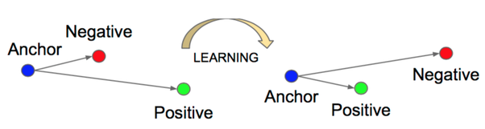
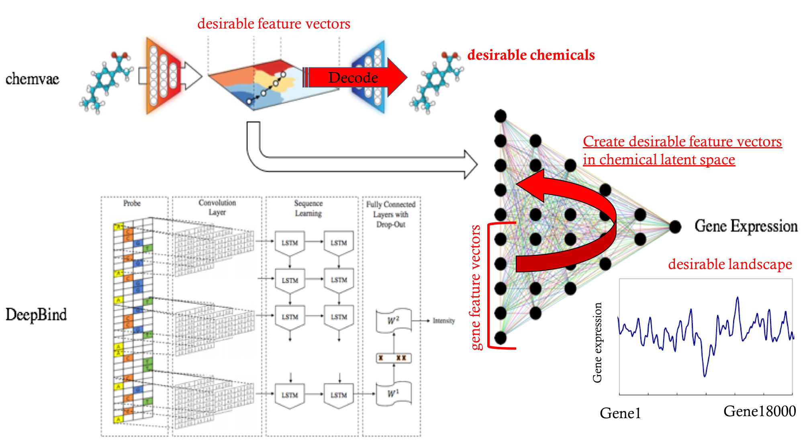

# DeepScreening

**Drug discovery screening** by **deep learning.**

## Setup

```sh
$ conda env create -f environment.yml
$ source activate deep-screening
# If you want to add your conda environment to your jupyter notebook.
# Install ipykernel.
$ conda install -c anaconda ipykernel
$ python -m ipykernel install --user --name=deep-screening
```

## Chemical

**chemvae**<sup><a href="#anchor1">[1]</a></sup> converts discrete representations of molecules ([SMILES](https://en.wikipedia.org/wiki/Simplified_molecular-input_line-entry_system)/[InChI](https://en.wikipedia.org/wiki/International_Chemical_Identifier)) to a multidimensional continuous representation. To enable molecular design and search, the chemical structures encoded in the continuous representation of the autoencoder need to be correlated with the target properties (**gene expression / epigenomic profiles**), so prediction model is added to vae. If joint model which predicts the properties of all genes is added to vae, the "new NP problem" is occured. Therefore, I use individual model insted.

|joint model|individual model|
|:-:|:-:|
|||

In order to learn a better representation, I use metric learning in representation space. The following features are used as indicators of the similarity between the chemicals.

- water–octanol partition coefficient (logP)
- the synthetic accessibility score (SAS)
- Quantitative Estimation of Drug-likeness (QED)
- Known target molecule
- Tanimoto coefficient

## Gene

In order to deal with the "new NP problem", gene must be converted into feature vectors. I use **DeeperBind**<sup><a href="#anchor2">[2]</a></sup> (Enhanced version of **DeepBind**<sup><a href="#anchor3">[3]</a></sup>), which contains a long short term recurrent convolutional network to capture the positional dynamics of probe sequences, to create them. It can be trained and tested on datasets containing **varying-length sequences.** I also use **metric learning** during this learning, and the following features are used.

- Pathway
    - [PPI(Protein-Protein Interaction)](https://en.wikipedia.org/wiki/Protein%E2%80%93protein_interaction)
    - [Reactome](https://en.wikipedia.org/wiki/Reactome)
    - [KEGG(Kyoto Encyclopedia of Genes and Genomes)](https://en.wikipedia.org/wiki/KEGG)
- Gene Ontology
- co-expression modules.<sup><a href="#anchor4">[4]</a></sup>


DeeperBind uses Deep Convolutional Neural Network to **chracterize multiple motifs** and the long-short term memory networks to **capture temporal (i.e. positional) features** on the probe sequences, but it is unclear that **"whether to use a CNN and how many layers"**, and **"whether to use an RNN, and the number of layers and their type"**, and also **"what kind of representation (one-hot or k-mer embedding) is the best for input"**, I use deepRAM<sup><a href="#anchor5">[5]</a></sup> to choose a deep learning model by selecting its different components.

## Metric learning

In order to create the desirble feature vectors in latent space, I use **triplet-loss**<sup><a href="#anchor6">[6]</a></sup>, which enables model to directly learn a good embeddings for each data (sequence/SMILES). In the embedding space, distances directly correspond to a measure of data similality. Therefore, onece this embedding has been produced, then the other kinds of tasks become straight-forward.



## training

Training a model by calculating all losses:

- triplet loss in chemical latent space.
- triplet loss in gene latent space.
- prediction loss in final result.

at once may prevent the model from convergence. Therefore, I use [zink database](https://zinc.docking.org/) to train chemical latent space, and [CCLE](https://portals.broadinstitute.org/ccle) to train gene latent space first. Then, train whole model with my own dataset. At this time, the learning rate of training feature vectors in latent space is reduced (fine tuning).

## feature works

Once a well-learned model is created, the feature vectors in the chemical latent space that realizes the desired landscape can be obtained by using the method of **Adversarial Exemple**<sup><a href="#anchor7">[7]</a></sup>. Then, by using the decoder of chemvae, the actual compounds can be restored from the feature vectors. This makes it possible to extract a drug with a high probability of exerting the desired effect.



## Reference

- <span id="anchor1">[1]</span> Automatic Chemical Design Using a Data-Driven Continuous Representation of Molecules (<small>[PubMed](https://www.ncbi.nlm.nih.gov/pubmed/29532027), [Github](https://github.com/aspuru-guzik-group/chemical_vae)</small>)
- <span id="anchor2">[2] DeeperBind: Enhancing Prediction of Sequence Specificities of DNA Binding Proteins</span> (<small>[arXiv](https://arxiv.org/abs/1611.05777)</small>)
- <span id="anchor3">[3]</span> Predicting the sequence specificities of DNA- and RNA-binding proteins by deep learning. (<small>[PubMed](https://www.ncbi.nlm.nih.gov/pubmed/26213851)</small>)
- <span id="anchor4">[4] Characterization of cancer omics and drug perturbations in panels of lung cancer cells</span> (<small>[sciReports](https://www.nature.com/articles/s41598-019-55692-9)</small>)
- <span id="anchor5">[5]</span> Comprehensive Evaluation of Deep Learning Architectures for Prediction of DNA/RNA Sequence Binding Specificities (<small>[arXiv](https://arxiv.org/abs/1901.10526v1), [GitHub](https://github.com/MedChaabane/deepRAM)</small>)
- <span id="anchor6">[6] Characterization of cancer omics and drug perturbations in panels of lung cancer cells</span> (<small>[arXiv](https://arxiv.org/abs/1503.03832), [Github](https://github.com/davidsandberg/facenet)</small>)
- <span id="anchor7">[7] Intriguing properties of neural networks</span> (<small>[arXiv](https://arxiv.org/abs/1312.6199)</small>)
