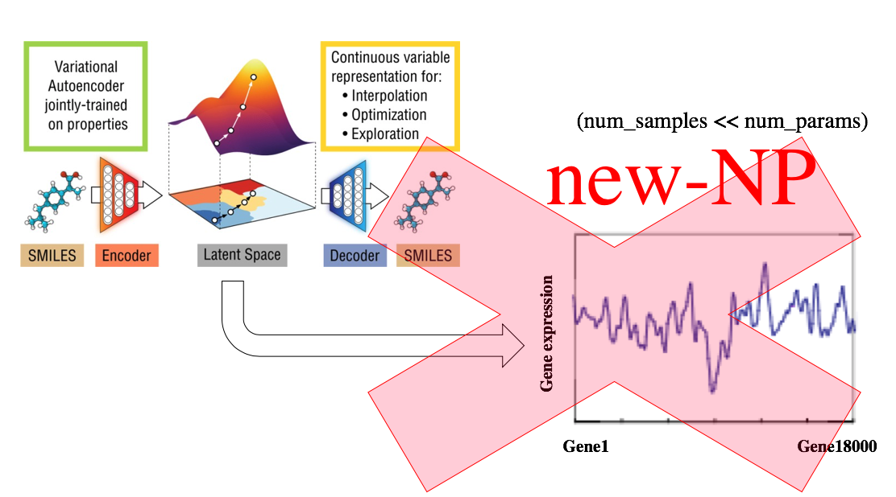
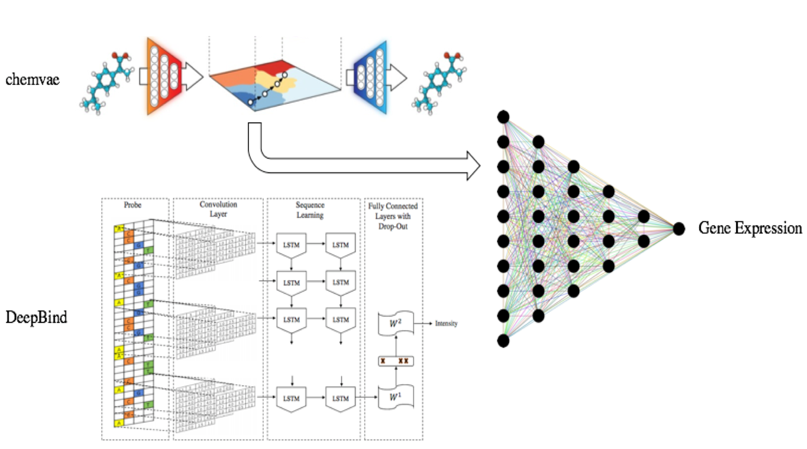

# DeepScreening

**Drug discovery screening** by **deep learning.**

## Setup

```sh
$ conda env create -f environment.yml
$ source activate deep-screening
```

## Chemical

**chemvae**<sup><a href="#anchor1">[1]</a></sup> converts discrete representations of molecules ([SMILES](https://en.wikipedia.org/wiki/Simplified_molecular-input_line-entry_system)/[InChI](https://en.wikipedia.org/wiki/International_Chemical_Identifier)) to a multidimensional continuous representation. To enable molecular design and search, the chemical structures encoded in the continuous representation of the autoencoder need to be correlated with the target properties (**gene expression / epigenomic profiles**), so prediction model is added to vae. If joint model which predicts the properties of all genes is added to vae, the "new NP problem" is occured. Therefore, I use individual model insted.

|joint model|individual model|
|:-:|:-:|
|||

In order to learn a better representation, I use metric learning in representation space. The following features are used as indicators of the similarity between the chemicals.

- water–octanol partition coefficient (logP)
- the synthetic accessibility score (SAS)
- Quantitative Estimation of Drug-likeness (QED)
- Known target molecule
- Tanimoto coefficient

## Gene

In order to deal with the "new NP problem", gene must be converted into feature vectors. I use **DeeperBind**<sup><a href="#anchor2">[2]</a></sup>, a long short term recurrent convolutional network to create them. It can be trained and tested on datasets containing **varying-length sequences.** I also use **metric learning** during this learning, and the following features are used.

- Pathway
    - [PPI(Protein-Protein Interaction)](https://en.wikipedia.org/wiki/Protein%E2%80%93protein_interaction)
    - [Reactome](https://en.wikipedia.org/wiki/Reactome)
    - [KEGG(Kyoto Encyclopedia of Genes and Genomes)](https://en.wikipedia.org/wiki/KEGG)
- Gene Ontology
- co-expression modules.<sup><a href="#anchor3">[3]</a></sup>

## Reference

- <span id="anchor1">[1]</span> Automatic Chemical Design Using a Data-Driven Continuous Representation of Molecules (<small>[PubMed](https://www.ncbi.nlm.nih.gov/pubmed/29532027), [Github](https://github.com/aspuru-guzik-group/chemical_vae)</small>)
- <span id="anchor2">[2] DeeperBind: Enhancing Prediction of Sequence Specificities of DNA Binding Proteins</span> (<small>[arXiv](https://arxiv.org/abs/1611.05777), [GitHub]()</small>)
- <span id="anchor3">[3] Characterization of cancer omics and drug perturbations in panels of lung cancer cells</span> (<small>[sciReports](https://www.nature.com/articles/s41598-019-55692-9)</small>)
- <span id="anchor">[]</span> A joint model of unpaired data from scRNA-seq and spatial transcriptomics for imputing missing gene expression measurements (<small>[arXiv](https://arxiv.org/abs/1905.02269v1), [GitHub](https://github.com/YosefLab/scVI)</small>)
- <span id="anchor">[]</span> Comprehensive Evaluation of Deep Learning Architectures for Prediction of DNA/RNA Sequence Binding Specificities (<small>[arXiv](https://arxiv.org/abs/1901.10526v1), [GitHub](https://github.com/MedChaabane/deepRAM)</small>)
- <span id="anchor">[]</span> Predicting the sequence specificities of DNA- and RNA-binding proteins by deep learning. (<small>[PubMed](https://www.ncbi.nlm.nih.gov/pubmed/26213851), [GitHub]()</small>)
- <span id="anchor">[]</span> (<small>[arXiv](), [GitHub]()</small>)
