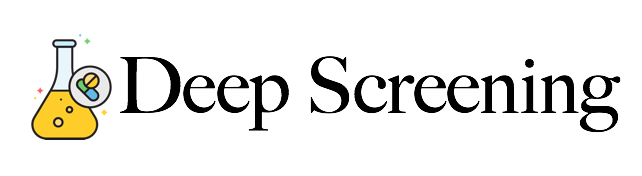

# DeepScreening

**Drug discovery screening** by **deep learning.**

## Chemical

chemical space

- water–octanol partition coefficient (logP)
- the synthetic accessibility score (SAS)
- Quantitative Estimation of Drug-likeness (QED)
- Known target molecule
- Tanimoto coefficient

## Gene

## Reference

<a href="#anchor1">[1]</a>

- [1] Automatic Chemical Design Using a Data-Driven Continuous Representation of Molecules (<small>[PubMed](https://www.ncbi.nlm.nih.gov/pubmed/29532027), [Github](https://github.com/aspuru-guzik-group/chemical_vae)</small>)
- [2] A joint model of unpaired data from scRNA-seq and spatial transcriptomics for imputing missing gene expression measurements (<small>[arXiv](https://arxiv.org/abs/1905.02269v1), [GitHub](https://github.com/YosefLab/scVI)</small>)
- [3] Comprehensive Evaluation of Deep Learning Architectures for Prediction of DNA/RNA Sequence Binding Specificities (<small>[arXiv](https://arxiv.org/abs/1901.10526v1), [GitHub](https://github.com/MedChaabane/deepRAM)</small>)
- [4] Predicting the sequence specificities of DNA- and RNA-binding proteins by deep learning. (<small>[PubMed](https://www.ncbi.nlm.nih.gov/pubmed/26213851), [GitHub]()</small>)
- [5] DeeperBind: Enhancing Prediction of Sequence Specificities of DNA Binding Proteins (<small>[arXiv](https://arxiv.org/abs/1611.05777), [GitHub]()</small>)
- [5] (<small>[arXiv](), [GitHub]()</small>)
